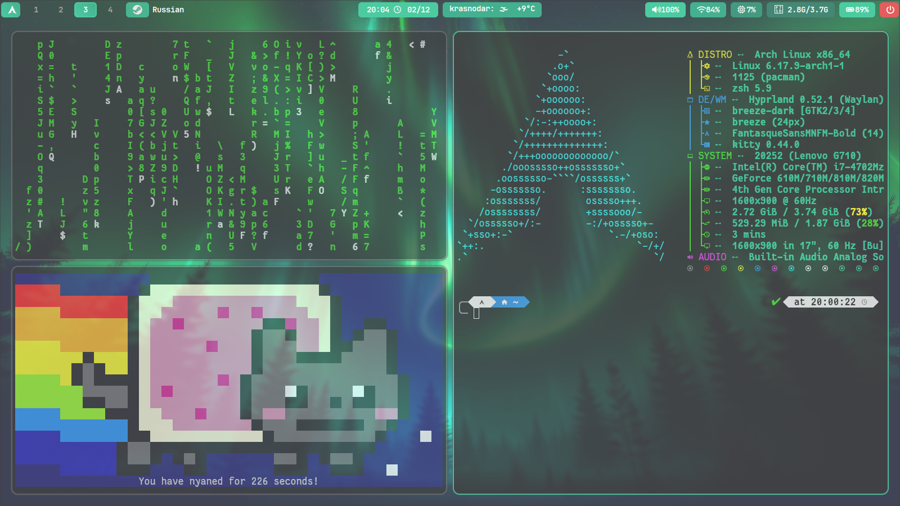

<h1 align="center">🔥🔥🔥FROSTTYPE-HYPRLAND🔥🔥🔥</h1>

My first hyprland rice, Created on Arch linux, it will be gradually updated and new features will be added.



PROGRAMS I USE:
<ol>
    <a href="https://github.com/hyprwm/Hyprland?ysclid=mioundt0ta466069158">Hyprland</a>
    <a href="https://github.com/hyprwm/hyprlock?ysclid=miouqfnrjg741351343">Hyprlock</a>
    <a href="https://github.com/Gustash/Hyprshot?ysclid=miour04lyc630453676">Hyprshot</a>
    <a href="https://github.com/Alexays/Waybar?ysclid=miourp3bgt733241527">Waybar</a>
    <a href="https://github.com/ArtsyMacaw/wlogout?ysclid=mious1uswb174880288">Wlogout</a>
    <a href="https://github.com/SimplyCEO/wofi?ysclid=miout72lds800440015">Wofi</a>
    <a href="https://github.com/kovidgoyal/kitty?ysclid=mioutn31bm67122232">Kitty</a>
    <a href="https://github.com/davatorium/rofi?ysclid=miovnyek40317642104">Rofi</a>
</ol>

<h2 align="center">💻INSTALATION💻</h2>

```bash
git clone https://github.com/Senya-debug/FrostType-Hyprland.git
cd FrostType-Hyprland
chmod +x install.sh
./hui.sh
```

<h2 align="center">📜CREDITS📜</h2>
<a href="https://github.com/JaKooLit/Hyprland-Dots">wallpaper</a>
<a href="https://github.com/Spelljinxer/dotfiles">animations</a>
